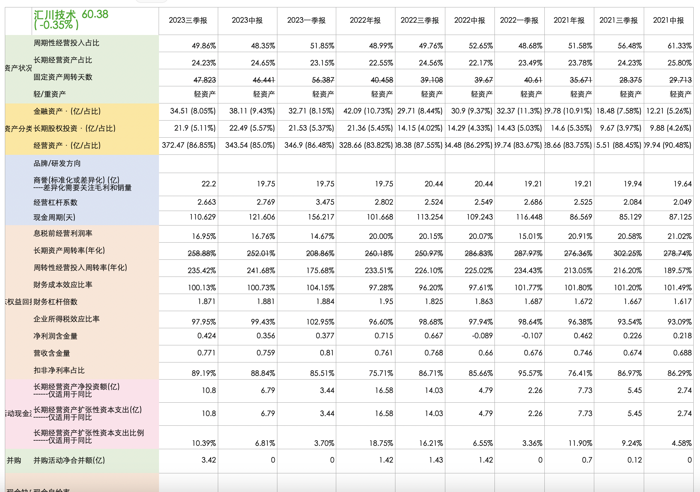

# stock-analysis
用于A 股市场的财务数据分析，采用雪球爬虫获取财务数据

# 关键财务数据解析器

## 介绍

该仓库是一个用于解析关键财务数据的工具，使用 Python 编写。通过修改 `xq_a_token` 的值，你可以访问相关的财务数据。执行 `fin.py` 文件即可开始解析数据。

效果图如下：




## 准备工作

在使用该工具之前，请确保完成以下准备工作：

1. 安装 Python：确保你的系统上安装了 Python，建议采用 Python 3.11，。你可以从 [Python 官网](https://www.python.org/) 下载并安装最新版本。

2. 获取 xq_a_token：在执行 `fin.py` 之前，你需要提供有效的 `xq_a_token`。你可以在 [雪球平台](https://xueqiu.com) 上获取该令牌。

## 使用步骤

1. 克隆仓库：

   ```bash
   git clone https://github.com/your-username/financial-data-parser.git
   cd financial-data-parser
   ```
   

2. 修改配置：

打开 fin.py 文件，将 xq_a_token 的值替换为你的有效令牌。
谷歌浏览器，访问https://xueqiu.com/S/SH600000
右键 “审查元素”，Application -> Cookies 找到 xq_a_token 键的值

3. 安装依赖执行脚本：

在终端中执行以下命令：

   ```bash
    pip install requests json openpyxl
    python fin.py
   ```
   
脚本将开始解析财务数据。

## 注意事项

请确保你的 xq_a_token 是有效的，否则可能无法正确获取数据。

该工具仅用于学习和研究目的，不得用于非法用途。

## 贡献
如果你有任何建议或改进意见，欢迎提出 Issue 或创建 Pull Request。


